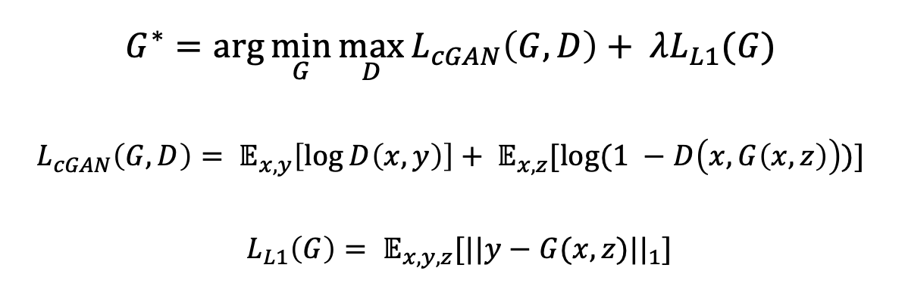
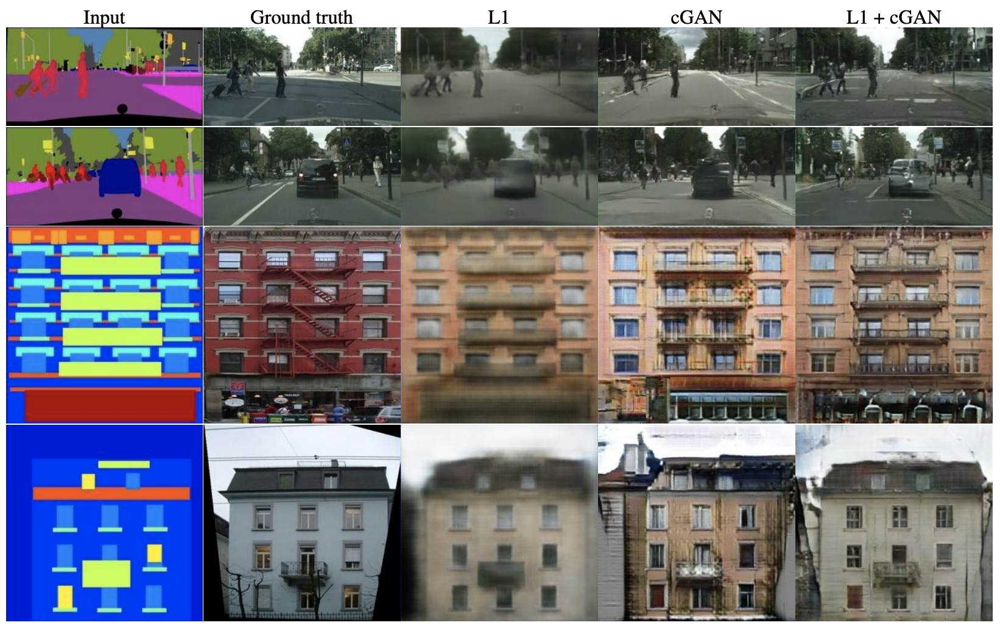
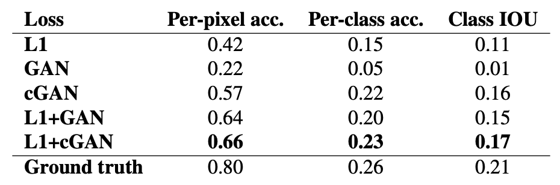
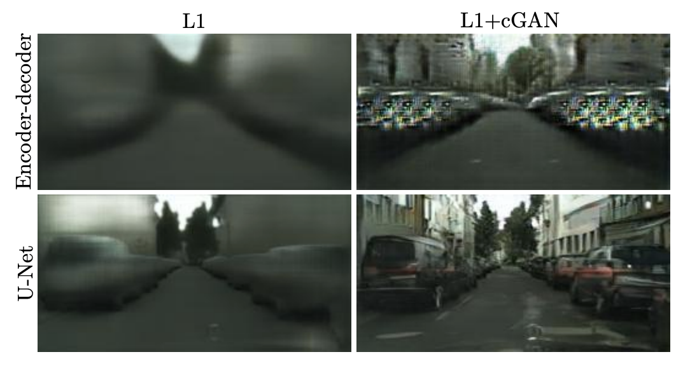
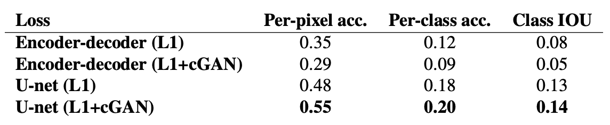
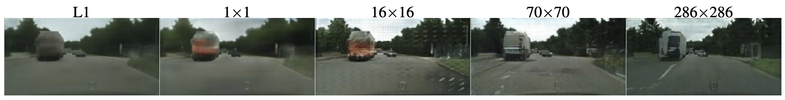
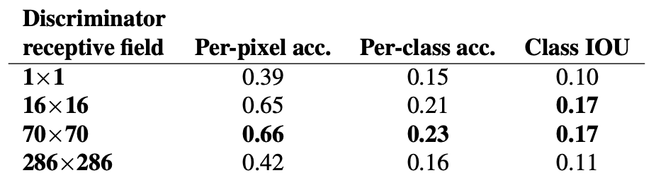
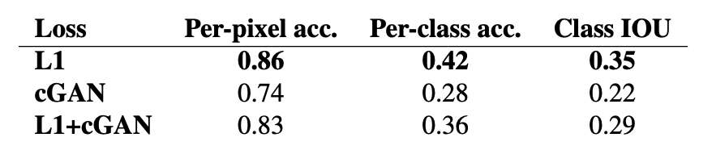

# pix2pix Implementation with Pytorch

## 0. Develop Environment

## 1. Explain about Implementation

## 2. Brief Summary of *'Image-to-Image Translation with Conditional Adversarial Networks'*

### 2.1. Goal
- Make general-purpose solution of image-to-image translation problems

### 2.2. Intuition
- GAN : can specify only a high-level goal (e.g. make the output indistinguishable from reality)

### 2.3. Tasks
- Semantic labels <-> Photo
- Architectural labels -> Photo
- Map <-> Aerial photo
- BW -> Color photos
- Edges -> Photo
- Sketch -> Photo
- Day -> Night
- Thermal -> Color photos
- Photo with missing pixels -> Inpainted photo

### 2.4. Evaluation Metrics
- Amazon Mechanical Turk (AMT)
- FCN-score

### 2.5. Network Architecture
- Modules of the form : convolution-BatchNorm-ReLU

#### 2.5.1. Generator : U-Net
- Add skip connections following the general shape of a "U-Net"

#### 2.5.2. Discriminator : PatchGAN
- L1 loss : accurately capture low-frequency correctness but not high-frequency crispness
- Restrict GAN discriminator to only model high-frequency structure
- Sufficient to restrict structure in local image patches to model high-frequency
- Penalize structure at the scale of patches
- Classify if each N*N patch in an image is real or fake and average all responses
- N can be much smaller than the full size of the image
- Smaller PatchGAN has fewer parameters, runs faster and can be applied on arbitrarily large images so advantageous
- Use N = 70 in the paper

### 2.6. Train and Inference
#### 2.6.1. Objective

- L1 loss
  * make generated image similar to ground truth
  * less blur in L1 compared to L2
  * use lambda = 100 in the paper
- Noise z
  * without z, net produce deterministic outputs
  * providing gaussian noise z as input did not worked (generator simply learned to ignore the noise)
  * providing noise in the form of dropout, applied on several layers of generator at both training and test time worked (but only minor stochasticity)

#### 2.6.2. Train Details
- Train procedure : alternate between one gradient descent step on discriminator, then one step on generator
  * training G to maximize log(1 - D(x, G(x, z)))
- Mini-batch gradient descent + Adam optimizer
  * learning rate : 0.0002
  * betas : (0.5, 0.999)

#### 2.6.3. Inference Details
- Same manner as during the training phase (dropout, batch normalization)
- Batch sizes : 1 ~ 10

### 2.7. Ablation Studies
#### 2.7.1. Objective

- L1 : blurry
- GAN : produce nearly the exact same output regardless of input
- cGAN : sharp but visual artifacts
- L1 + cGAN : sharp and reduce artifacts

#### 2.7.2. Generator

- Encoder-Decoder : U-Net without skip connections

#### 2.7.3. Discriminator

|Patch Size N|Result|
|:-:|:-:|
|N = 1 (PixelGAN)|no effect on spatial sharpness but does increase the colorfulness of the results|
|N = 16 (PatchGAN)|sharp but tiling artifacts|
|N = 70 (PatchGAN)|sharp and less artifacts|
|N = 286 (ImageGAN)|no improvement|

- ImageGAN has many more parameters and greater depth than 70*70 PatchGAN that makes harder to train and causes no improvement

### 2.8. Application in Vision Task

- Experiment on semantic segmentation
- Success but far from the best available method
- For vision problems, the goal may be less ambiguous than graphics tasks and reconstruction losses like L1 are mostly sufficient

## 3. Reference Paper
- Image-to-Image Translation with Conditional Adversarial Networks [[paper]](https://arxiv.org/pdf/1611.07004.pdf)
